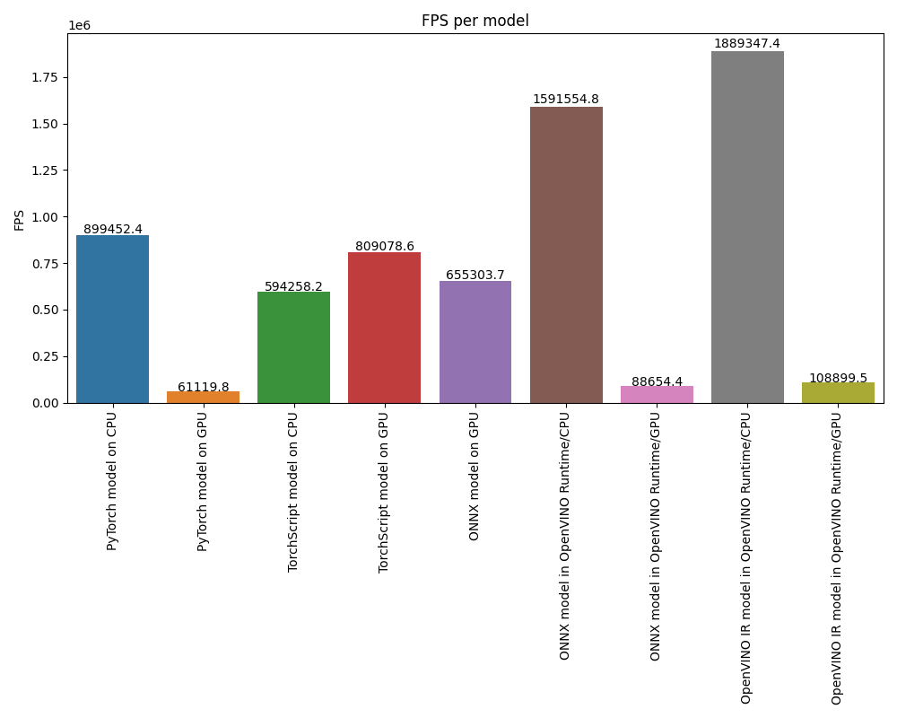
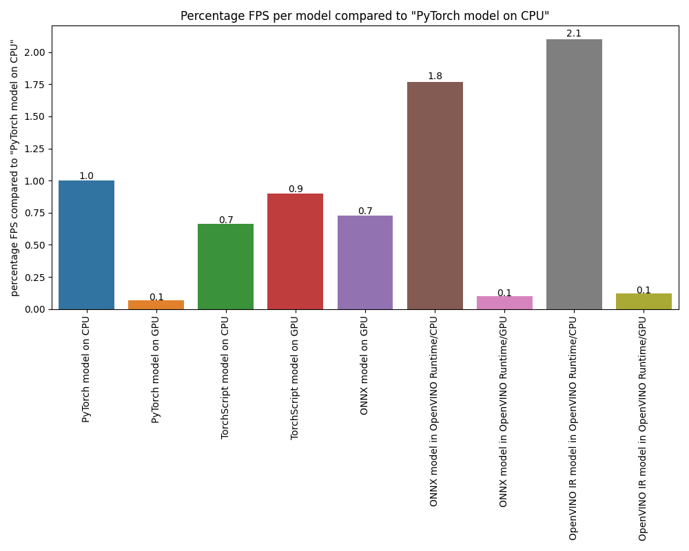

# Setup

## 1. Install Python and other depencies

```bash
sudo apt-get update
sudo apt-get upgrade
sudo apt-get install python3-venv build-essential python3-dev git-all
```

To install OpenCL drivers, execute the following:
```bash
sudo apt-get install intel-opencl-icd
```

## 2. Clone this repository

```bash
git clone https://github.com/Ankur-singh/cmpe255
cd cmpe255/BONUSWORK\ 1/
```

## 3. Create conda environment with python 3.8

```bash
conda create -n openvino_env python=3.8
conda activate openvino_env
```

## 4. Install all dependencies

```bash
python -m pip install -U pip==21.3.0
pip install -r requirements.txt 
```

# Usage

## 1. Export Pytorch model to other formats

```bash
python export.py -o model_weights
```

This script will export pytorch model `model.pt`, to the following formats
- TorchScript CPU
- TorchScript GPU
- ONNX
- OpenVino IR 

## 2. Benchmark

```bash
python benchmark.py
```

This script will load the models from `model_weights` directory and run inference 200 times on a randomly generated sample. The script will also generate bar plots for FPS and percentage FPS compared to base Pytorch model.





## 3. Gradio App

```bash
gradio app.py
```

This scripts will run a gradio app so that one can easily test all the model formats on different devices. 


You can also make API calls to the Gradio app. You should see the option at the bottom of the page, its highlighted in red.


