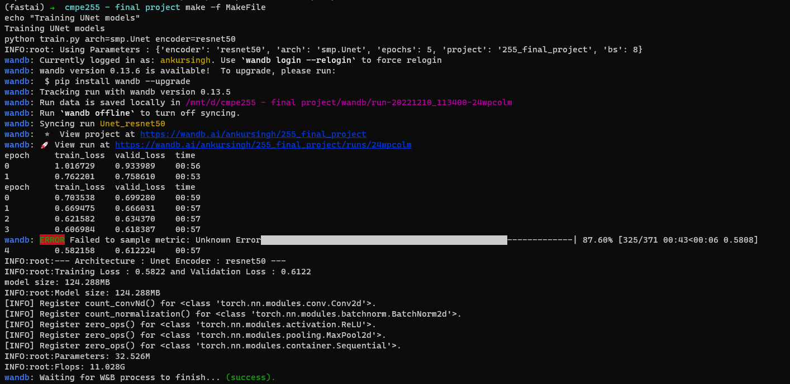
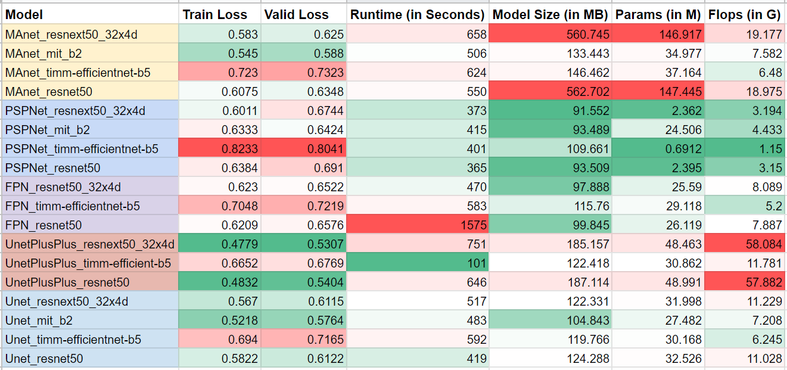

# Semantic Segmentation - 255 final project

## Setup

1. Git clone this repo

```bash
git clone https://github.com/Ankur-singh/cmpe255.git
```

2. Create new conda environment and activate it

```bash
conda create -n cmpe255
conda activate cmpe255
```

3. Install python dependencies

```bash
pip install -r requirements.txt
```

4. Setup up Wandb

To enable wandb tracking, its important that you login to wandb using the following command

```bash
wandb login
```

This should open a new tab in your browser. Just copy if the token key and paste it. 

## Usage

There are only two important files:

- `utils.py` : it has all the utility functions for creating custom learner, dynamically loading SMP architectures, getting model size, params, and flops.
- `train.py` : this is the main script responsible for loading the cityscapes dataset, and training the segmentation models.

Here is a list of arguments that it takes:
- `encoder` : The CNN backbone that is to be used. You can use any encoder from SMP library. Default : `mit_b2`
- `arch` : The Segmentation architecture that is to be used. Any architecture from SMP library. Default : `smp.MAnet`
- `epochs` : Number of epochs to train for in Stage-2 (i.e. complete model). Default : `5`
- `project` : wandb project for tracking. Default : `255_final_project`
- `bs` : Batch size. Default : `8`

Here an examples to highlight the usage of `train.py` script:

```bash
python train.py arch=smp.Unet encoder=timm-efficientnet-b5 bs=16 epochs=10
```

### Notes:

- `epochs` argument : The model training is divided into two parts: Stage-1 and Stage-2. In Stage-1, only the decoder and head block will be trained for 2 epochs. Then in Stage-2, all the three blocks (i.e. encoder, decoder, and head) will be trained at half the initial learning rate of 0.001. The `epochs` argument in training script is used to set number of epochs in Stage-2.

- `arch` argument : One can use any segmentation model from SMP library. There are around 9 possible options to select from. Instead of writing if-else block for each, I am loading the segmentation model class dynamically using `load_obj` function from `utils.py` file. Hence, it is important that you append `smp.` before you architecture name because I am importing `segmentation_models_pytorch` as `smp` inside `utils.py`

- I am using OneCycleLR scheduler because it tends to converge much quickly. Hence, I am training the models for 5 epochs only. 

### Makefile

You can also use the `make` command to train all the models. 

```bash
make -f Makefile
```

To train only one class of models, run the following command. Possible model classes are `unet`, `unetpp`, `fpn`, `pspnet`, and `manet`.
```bash
make -f Makefile <model_class>
```

Here is a screenshot showing the output of the above command:




## Results:

Here are all the details collected during the training process. W&B dashboard can be found [here](https://wandb.ai/ankursingh/255_final_project).




You can find the [Spreadsheet here](https://docs.google.com/spreadsheets/d/15Bf3LZAG-UKH4k6CDSzhXIzEU7hqz4HiP6lrVv89Ri0/edit?usp=sharing), if you want to use the table interactively.

Here are some insights from the table

- Generally speaking, `UnetPlusPlus` and `UNet` architecture, with any backbone, perform the best in term of `Valid Loss`. On the other hand, `PSPNet` performs the worst.
- Even though `PSPNet` is worst in terms of `Valid Loss` it is the best architecture in terms of all other metrics (i.e. `Runtime`, `Model Size`, `Params`, and `FLOPs`). 
- `MAnet` performs well with different backbones but is quite expensive in terms of `Model Size`, and `Params`.
- You will see low `Valid Loss` if you use `resnext50_32x4d` or `resnet50` as backbone when compared to other backbones. But these models are very expensive in terms of compute, model size, and training time.
- `timm-efficientnet-b5` backbone leads to significant lower number of flops but tends to perform poorly (in terms of valid loss).
- Both `MAnet_mit_b2` and `Unet_mit_b2` are very similar in almost every aspect. These two architecture with `mit_b2` backbone looks like a good balance between performance, compute requirement, and model size.


## Fastai + SMP

Integrating Fastai with SMP was the most fun and challenging part. In the process, I ended up learning more about the Fastai Learner and its internals. 

I created a custom `seg_learner` function which is inspired by `unet_learner`. 

```python
def seg_learner(
    dls,
    arch,
    encoder,
    weights,
    normalize=True,
    n_out=None,
    freeze=-2,
    config=None,
    pretrained=True,
    loss_func=None,
    opt_func=Adam,
    lr=defaults.lr,
    splitter=segment_split,
    cbs=None,
    metrics=None,
    path=None,
    model_dir="models",
    wd=None,
    wd_bn_bias=False,
    train_bn=True,
    moms=(0.95, 0.85, 0.95),
    **kwargs
):

    cfg = smp.encoders.get_preprocessing_params(encoder, weights)
    n_in = kwargs["n_in"] if "n_in" in kwargs else 3
    if normalize:
        _smp_norm(dls, cfg)

    n_out = ifnone(n_out, get_c(dls))
    assert (n_out), "`n_out` is not defined, and could not be inferred from data, set `dls.c` or pass `n_out`"
    
    model = arch(
        encoder_name=encoder,
        encoder_weights=weights,
        in_channels=n_in,
        classes=n_out,
    )

    learn = Learner(
        dls=dls,
        model=model,
        loss_func=loss_func,
        opt_func=opt_func,
        lr=lr,
        splitter=splitter,
        cbs=cbs,
        metrics=metrics,
        path=path,
        model_dir=model_dir,
        wd=wd,
        wd_bn_bias=wd_bn_bias,
        train_bn=train_bn,
        moms=moms,
    )
    if pretrained:
        learn.freeze_to(freeze)

    # keep track of args for loggers
    store_attr("encoder,normalize,n_out,pretrained,cfg", self=learn, **kwargs)
    return learn

```

As you can see, it takes `arch` and `encoder` as input and created a SMP model. There are some other functions that had to be updated to make it work like `segment_split`, `Learner.fine_tune`  method, etc. 


## References

- Fastai `Learner` class : https://github.com/fastai/fastai/blob/master/fastai/learner.py#L97
- SMP `create_model` function : https://github.com/qubvel/segmentation_models.pytorch/blob/master/segmentation_models_pytorch/\_\_init\_\_.py#L23
- [Keypoint regression with heatmaps in fastai v2](https://elte.me/2021-03-10-keypoint-regression-fastai) To better understand fastai internals, I used this as inspiration to learn and make fastai operate with other libraries and other problem types.